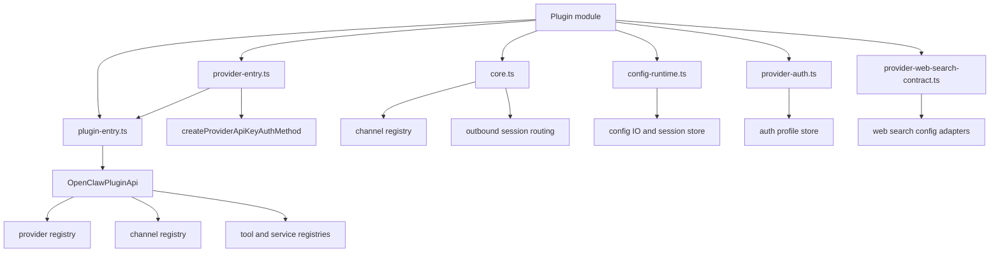
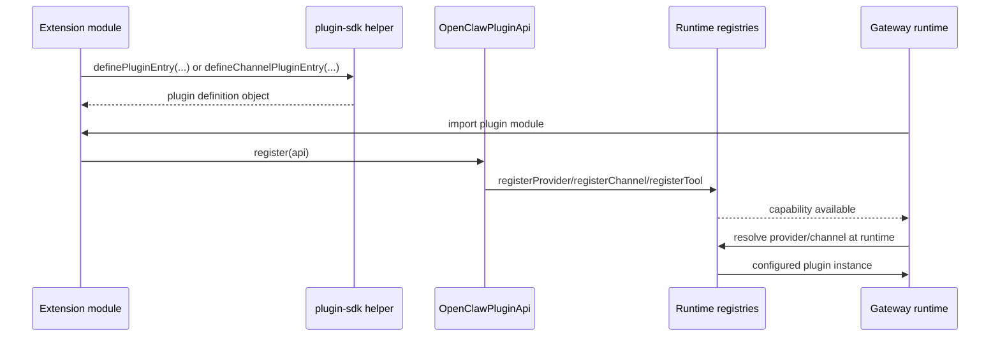

The OpenClaw SDK is intentionally split into small public boundary modules. Instead of importing deep runtime internals, extensions choose a focused subpath such as `openclaw/plugin-sdk/provider-entry`, `openclaw/plugin-sdk/core`, or `openclaw/plugin-sdk/config-runtime`. That design shows up directly in the source tree: the public files live in `src/plugin-sdk/*.ts`, and most of them either define a small helper or re-export a carefully chosen runtime surface.

## Key Design Decisions

### 1. Public boundaries are explicit files, not a single giant barrel

The top-level export map is broad, but the SDK itself stays modular. Files such as `src/plugin-sdk/plugin-entry.ts`, `src/plugin-sdk/provider-entry.ts`, `src/plugin-sdk/config-runtime.ts`, and `src/plugin-sdk/provider-web-search-contract.ts` each expose one narrow responsibility. That keeps package-boundary imports stable even when internal folders move.

### 2. Plugin config schemas are evaluated lazily

`definePluginEntry` in `src/plugin-sdk/plugin-entry.ts` wraps `configSchema` with `createCachedLazyValueGetter` from `src/plugin-sdk/lazy-value.ts`. The result is a getter-backed `configSchema` property that only computes once. This matters because several bundled extensions build large zod or TypeBox schemas and should not eagerly execute them during startup or metadata scans.

### 3. Common provider boilerplate is centralized

`defineSingleProviderPluginEntry` in `src/plugin-sdk/provider-entry.ts` translates a compact options object into `api.registerProvider(...)` calls, API-key auth methods, wizard metadata, and a provider catalog. Bundled providers such as `extensions/deepseek/index.ts` and `extensions/qwen/index.ts` use this helper to keep auth prompts, env vars, and catalog logic aligned.

### 4. Channel plugins are composed, not subclassed

`createChatChannelPlugin` in `src/plugin-sdk/core.ts` assembles DM security, pairing, threading, and outbound delivery adapters into one `ChannelPlugin`. `defineChannelPluginEntry` then handles registration mode differences such as `cli-metadata` versus `full`. The Google Chat plugin in `extensions/googlechat/src/channel.ts` and the QA channel in `extensions/qa-channel/src/channel.ts` both follow that pattern.

### 5. Contract-safe helper modules separate setup code from full runtime code

Several SDK files are deliberately thin re-export boundaries. `config-runtime.ts` exposes config and session helpers, `runtime-env.ts` exposes process and logging utilities, `secret-input.ts` exposes secret schema helpers, and `provider-web-search-contract.ts` exposes search-provider config wiring without forcing plugin authors to depend on private runtime files. This keeps setup flows, browser tooling, and extension packages small.

### 6. Specialized capabilities keep their own stable type contracts

`src/plugin-sdk/video-generation.ts` copies the public video capability types into the SDK file instead of re-exporting them blindly. The compatibility assertions in that file make sure the SDK contract stays assignable to the core runtime types while still giving package consumers a stable declaration surface.

## Request and Registration Lifecycle

## How The Pieces Fit Together

At authoring time, the extension imports only SDK modules. At activation time, OpenClaw loads the plugin module and calls the `register` function exposed by the plugin entry. For provider plugins, `provider-entry.ts` may register auth methods, env vars, aliases, and catalog builders before any optional custom `register` hook runs. For channel plugins, `defineChannelPluginEntry` adds the channel capability first, then optionally runs CLI-metadata or full-runtime extras.

During execution, plugins drop into specialized boundaries instead of private imports. A setup wizard can call `loadConfig` and `writeConfigFile` through `config-runtime.ts`, a provider can normalize tool schemas through `provider-tools.ts`, a search plugin can adapt scoped credentials through `provider-web-search-contract.ts`, and a browser-facing plugin can use `browser-security-runtime.ts` to keep filesystem access and SSRF checks inside a supported contract.

The net effect is a layered architecture: extension module -> SDK subpath -> registry API -> gateway runtime. The SDK hides churn in internal folders while preserving the real behaviors that matter to plugin authors.
