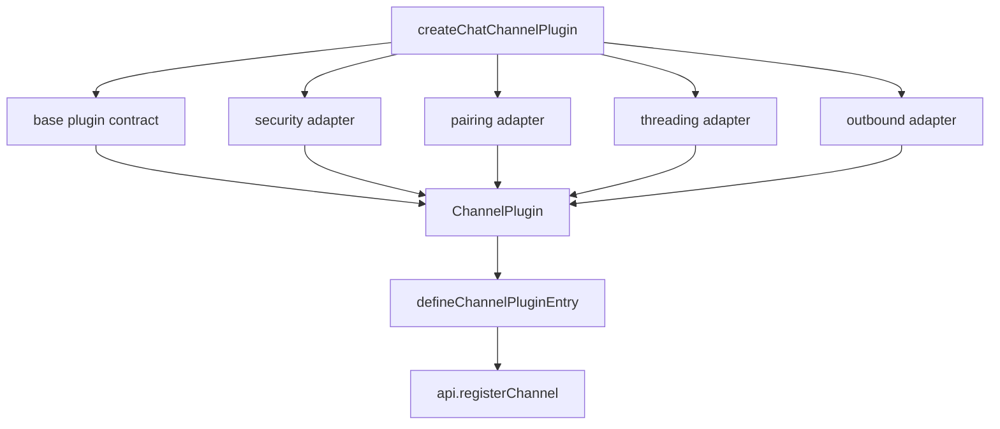

Channel plugins are the most structured part of the SDK because they have to integrate with real messaging surfaces. `src/plugin-sdk/core.ts` gives channel authors a set of composition helpers so they can reuse the same patterns across Slack, Google Chat, Telegram, QA channels, and many more.

## What A Channel Plugin Is

A channel plugin wraps setup, account config resolution, target normalization, outbound delivery, status probing, and optional security or pairing behavior into one `ChannelPlugin`. Instead of asking each extension to implement that whole contract manually, the SDK offers `createChatChannelPlugin`, `createChannelPluginBase`, `defineChannelPluginEntry`, and `defineSetupPluginEntry`.

## How It Relates To Other Concepts

- `defineChannelPluginEntry` is the channel-specific sibling of `definePluginEntry`.
- `buildChannelOutboundSessionRoute` ties messaging targets back to OpenClaw session routing.
- `channel-streaming.ts`, `channel-secret-runtime.ts`, and `config-runtime.ts` are common support modules for channel behavior.

## Internal Composition



`createChatChannelPlugin` in `src/plugin-sdk/core.ts` does four important things. It ensures `conversationBindings.supportsCurrentConversationBinding` defaults to `true`, normalizes DM security rules through `buildAccountScopedDmSecurityPolicy`, adapts inline text pairing definitions into a `ChannelPairingAdapter`, and can wrap outbound methods so attached results always include the channel ID. The QA channel in `extensions/qa-channel/src/channel.ts` shows outbound route construction, while `extensions/googlechat/src/channel.ts` shows a larger production plugin with security, setup, directory, actions, status, and gateway startup logic.

Basic channel example:

```ts
import {
  buildChannelOutboundSessionRoute,
  createChatChannelPlugin,
  defineChannelPluginEntry,
} from "openclaw/plugin-sdk/core";

const plugin = createChatChannelPlugin({
  base: {
    id: "demo-chat",
    meta: { id: "demo-chat", label: "Demo Chat", docsPath: "/channels/demo-chat" },
    capabilities: { chatTypes: ["direct", "group"] },
    setup: { applyAccountConfig: ({ cfg }) => cfg },
    messaging: {
      normalizeTarget: (raw) => raw.trim(),
      resolveOutboundSessionRoute: ({ cfg, agentId, target }) =>
        buildChannelOutboundSessionRoute({
          cfg,
          agentId,
          channel: "demo-chat",
          peer: { kind: "direct", id: target },
          chatType: "direct",
          from: "demo-chat:default",
          to: target,
        }),
    },
  },
});

export default defineChannelPluginEntry({
  id: "demo-chat",
  name: "Demo Chat",
  description: "Minimal chat channel",
  plugin,
});
```

Advanced example with pairing and attached outbound results:

```ts
import { createChatChannelPlugin } from "openclaw/plugin-sdk/core";

export const demoPlugin = createChatChannelPlugin({
  base: {
    id: "demo-chat",
    meta: { id: "demo-chat", label: "Demo Chat", docsPath: "/channels/demo-chat" },
    setup: { applyAccountConfig: ({ cfg }) => cfg },
  },
  pairing: {
    text: {
      idLabel: "user id",
      message: "Your Demo Chat pairing request was approved.",
      notify: async ({ message, send }) => {
        await send(message);
      },
    },
  },
  outbound: {
    base: { deliveryMode: "direct" },
    attachedResults: {
      channel: "demo-chat",
      sendText: async ({ text, to }) => ({ messageId: `${to}:${text.length}` }),
    },
  },
});
```

<Callout type="warn">
If a channel ships a separate `setup-entry.ts`, keep it as a setup-only surface. `defineChannelPluginEntry` behaves differently for `cli-metadata`, partial registration, and `full` registration modes. Mixing heavy runtime side effects into setup-only modules can make onboarding and metadata commands slower or incorrect.
</Callout>

<Accordions>
  <Accordion title="createChatChannelPlugin versus assembling ChannelPlugin by hand">
    The helper is best when the channel is fundamentally chat-like and wants the standard OpenClaw behavior for DM policy, pairing, reply threading, and outbound result shaping. Hand-assembling a raw `ChannelPlugin` gives maximum control, but you then own a large amount of subtle compatibility behavior that other channels already share. The Google Chat and QA channel implementations show that even very different integrations still benefit from the shared builder. Use the lower-level route only when the channel is structurally unlike normal chat delivery.
  </Accordion>
  <Accordion title="Inline adapters versus dedicated adapter modules">
    Inline adapters are perfect for small proof-of-concept channels because the logic stays close to the plugin declaration. Once the channel starts handling approval flows, directory lookups, mutable allowlists, or gateway startup, separate adapter modules scale better and are easier to test. That is why `extensions/googlechat/src/channel.ts` wires together adapters from several files instead of placing all logic in one export. Split early if the plugin touches real platform security or reply semantics.
  </Accordion>
</Accordions>

Next: [Runtime Boundaries](/docs/runtime-boundaries) and the [channel-core API page](/docs/api-reference/channel-core).
