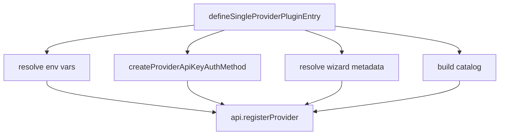

Provider plugins translate an external model provider into OpenClaw's provider registry. The SDK supports two common styles: a generic plugin built with `definePluginEntry`, and a higher-level single-provider wrapper built with `defineSingleProviderPluginEntry` from `src/plugin-sdk/provider-entry.ts`.

## Why This Concept Exists

Almost every provider extension repeats the same work: prompt for an API key, expose an env var, register onboarding choices, return a provider catalog, and sometimes patch tool schemas or replay behavior. The single-provider helper centralizes that pattern so bundled providers such as DeepSeek and Qwen can stay focused on provider-specific logic rather than registration glue.

## How It Relates To Other Concepts

- It builds on `definePluginEntry`, not beside it.
- It often pairs with `provider-auth.ts`, `provider-auth-runtime.ts`, and `provider-onboard.ts`.
- It frequently uses `provider-tools.ts`, `provider-model-shared.ts`, and `provider-http.ts` to normalize schemas and transport policy.

## Internal Mechanics



`src/plugin-sdk/provider-entry.ts` accepts `SingleProviderPluginOptions`. If `provider.auth` is present, it maps each auth entry through `createProviderApiKeyAuthMethod`, fills in provider IDs and expected providers, and derives wizard metadata when you do not override it. It also folds explicit `provider.envVars` together with env vars declared on auth methods, which is why bundled plugins can stay terse.

Basic single-provider example:

```ts
import { defineSingleProviderPluginEntry } from "openclaw/plugin-sdk/provider-entry";

export default defineSingleProviderPluginEntry({
  id: "deepseek-like",
  name: "DeepSeek Like Provider",
  description: "Minimal single-provider plugin",
  provider: {
    label: "DeepSeek Like",
    docsPath: "/providers/deepseek-like",
    auth: [
      {
        methodId: "api-key",
        label: "Provider API key",
        hint: "API key",
        envVar: "DEEPSEEK_LIKE_API_KEY",
        promptMessage: "Enter the provider API key",
      },
    ],
    catalog: {
      buildProvider: ({ apiKey }) => ({
        id: "deepseek-like",
        label: "DeepSeek Like",
        apiKey,
      }),
    },
  },
});
```

Advanced provider bundle example:

```ts
import { definePluginEntry } from "openclaw/plugin-sdk/plugin-entry";
import { buildProviderToolCompatFamilyHooks } from "openclaw/plugin-sdk/provider-tools";

export default definePluginEntry({
  id: "acme-openai-style",
  name: "Acme OpenAI Style Provider",
  description: "Registers multiple capabilities for one provider family",
  register(api) {
    const hooks = buildProviderToolCompatFamilyHooks("openai");

    api.registerProvider({
      id: "acme-openai",
      label: "Acme OpenAI",
      docsPath: "/providers/acme-openai",
      auth: [],
      catalog: { order: "simple", run: async () => null },
      ...hooks,
    });

    api.registerVideoGenerationProvider({
      id: "acme-video",
      capabilities: { supportsAspectRatio: true },
      async generateVideo(req) {
        return { videos: [], metadata: { requestedModel: req.model } };
      },
    });
  },
});
```

<Callout type="warn">
Keep `provider.id`, the plugin `id`, and any aliases intentionally aligned. `provider-entry.ts` defaults `provider.id` to the plugin `id`, so mismatches are fine only when you are deliberately supporting legacy provider names like Qwen's `modelstudio` alias in `extensions/qwen/index.ts`.
</Callout>

<Accordions>
  <Accordion title="Single-provider helper versus raw definePluginEntry">
    `defineSingleProviderPluginEntry` is the fastest path when one plugin mainly exists to register one provider plus light extras. It handles auth, env vars, wizard choices, and default catalog construction automatically, which keeps files like `extensions/deepseek/index.ts` compact. Raw `definePluginEntry` is a better fit when one package registers multiple providers or multiple capability families. The OpenAI bundled extension is the clearest example because it also registers CLI, media-understanding, speech, image, and video capabilities.
  </Accordion>
  <Accordion title="Catalog builder helper versus fully custom catalog.run">
    The `buildProvider` branch is ideal when your provider can be described from API key plus config and does not need custom discovery logic. The `run` branch is better when you need to inspect config, normalize base URLs, or return `null` when credentials are missing, as Qwen does in `extensions/qwen/index.ts`. The trade-off is convenience versus control: `buildProvider` keeps your entry file cleaner, while `run` keeps edge cases explicit and debuggable. Prefer the simpler path until the provider really needs custom resolution.
  </Accordion>
</Accordions>

Next: [Provider auth and runtime helpers](/docs/api-reference/provider-auth) and [provider model helpers](/docs/api-reference/provider-models).
