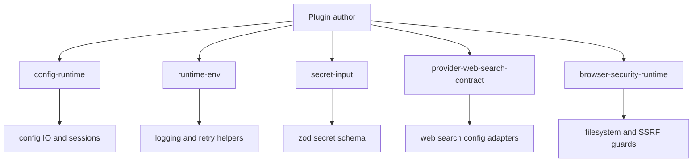

The most important architectural idea in the SDK is not a single function. It is the collection of boundary modules that sit between plugin code and the private runtime. These files are mostly in `src/plugin-sdk/*.ts`, and each one exposes a small, supported slice of behavior: config I/O, env and logging helpers, doctor utilities, secret schemas, search-provider contracts, browser-safe helpers, or ACP runtime integration.

## Why These Modules Exist

OpenClaw's internal folders are large and evolve quickly. If extension authors imported directly from `src/config`, `src/channels`, or `src/infra`, package-boundary stability would break fast. The SDK solves that by publishing curated re-export bundles such as:

- `config-runtime.ts` for config and session-store access
- `runtime-env.ts` for logging, retries, backoff, and runtime shims
- `runtime-doctor.ts` for compatibility and uninstall helpers
- `secret-input.ts` for schema-safe secret values
- `provider-web-search-contract.ts` for contract-safe search provider config wiring
- `browser-security-runtime.ts` and `browser-node-runtime.ts` for browser-related setup and gateway interactions

## How It Works Internally



Most of these files are intentionally thin. `config-runtime.ts` does not add new logic; it freezes a stable set of helpers like `loadConfig`, `writeConfigFile`, `resolveSessionKey`, and `resolveChannelGroupPolicy`. `runtime-env.ts` does the same for common runtime concerns like `retryAsync`, `computeBackoff`, and verbose logging. `secret-input.ts` is slightly different: it layers convenience functions such as `buildOptionalSecretInputSchema()` and `buildSecretInputArraySchema()` over the underlying `buildSecretInputSchema()` from `src/plugin-sdk/secret-input-schema.ts`.

Basic example: config-safe setup code.

```ts
import { loadConfig, writeConfigFile } from "openclaw/plugin-sdk/config-runtime";

export async function enablePlugin(configPath?: string) {
  const cfg = await loadConfig(configPath);
  cfg.plugins ??= {};
  cfg.plugins.entries ??= {};
  cfg.plugins.entries.demo = { enabled: true };
  await writeConfigFile(cfg, configPath);
}
```

Advanced example: search contract plus secret schema in one setup flow.

```ts
import { buildOptionalSecretInputSchema } from "openclaw/plugin-sdk/secret-input";
import { createWebSearchProviderContractFields } from "openclaw/plugin-sdk/provider-web-search-contract";

const ApiKeySchema = buildOptionalSecretInputSchema();

export const searchContract = createWebSearchProviderContractFields({
  credentialPath: "plugins.entries.demo.config.webSearch.apiKey",
  searchCredential: { type: "top-level" },
  configuredCredential: { pluginId: "demo" },
  selectionPluginId: "demo",
});

export function parseApiKey(value: unknown) {
  return ApiKeySchema.parse(value);
}
```

<Callout type="warn">
Choose the contract-safe boundary that matches your use case instead of importing the first internal helper you find. For example, use `provider-web-search-contract` when you need stable credential wiring, and only use the broader `provider-web-search` module when you also need runtime helpers like caching and trusted endpoint posting.
</Callout>

<Accordions>
  <Accordion title="Thin re-export boundaries versus new wrapper abstractions">
    OpenClaw deliberately uses thin boundary files for most runtime helpers because plugin authors often need the real underlying behavior, not a second abstraction layer. This keeps the published surface honest: if `loadConfig` changes, the boundary file is the only place that needs review. The downside is that the API reference looks broad, because many modules are curated re-export bundles rather than small classes. That trade-off is worthwhile for package stability and lower cognitive overhead when moving from bundled extensions to your own plugin.
  </Accordion>
  <Accordion title="Contract-safe subpaths versus broader capability subpaths">
    Some modules intentionally come in pairs. `provider-web-search-contract` stays narrow and safe for setup or config code, while `provider-web-search` exposes larger runtime helpers such as cache handling, timeouts, and trusted endpoint posting. The same pattern appears in browser-oriented modules, where `browser-security-runtime` focuses on safe file access and network policy while `browser-node-runtime` reaches into gateway request handling. Pick the narrowest subpath that solves the job so your plugin keeps a clean dependency graph.
  </Accordion>
</Accordions>

Next: [Guides](/docs/guides/build-provider) and the grouped API pages for [runtime and config](/docs/api-reference/config-and-runtime) and [security and streaming](/docs/api-reference/security-and-streaming).
